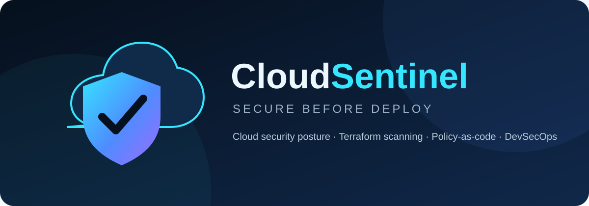
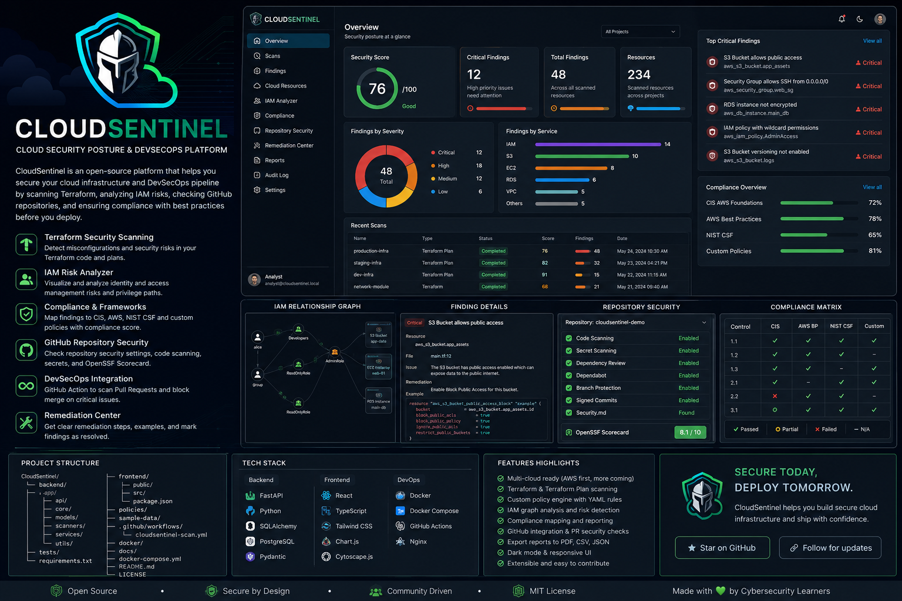
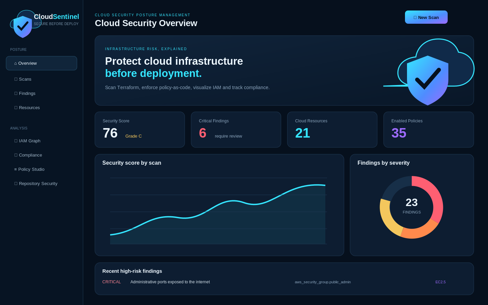

<p align="center">
  
</p>



<p align="center">
  <strong>Terraform security scanning and policy-as-code evidence for DevSecOps teams</strong><br>
  Find cloud misconfigurations before deployment, prioritize deterministic risk, and export remediation-ready results to CI.
</p>

<p align="center">
  
  
  
  
  
</p>

## Overview

CloudSentinel is a defensive static-analysis platform that analyzes Terraform HCL, Terraform JSON, and common plan/state JSON structures **without executing infrastructure code**. It converts infrastructure into a normalized inventory, evaluates 35 versioned policies, creates actionable findings, calculates explainable risk, maps compliance controls, visualizes IAM relationships, and exports human- and machine-readable evidence.

<p align="center"></p>

The project is designed to demonstrate practical skills in:

- Cloud Security Posture Management (CSPM)
- Infrastructure as Code security
- Policy-as-code design
- DevSecOps and repository security
- Risk scoring and remediation workflows
- FastAPI, SQLAlchemy, reporting, testing, Docker, and CI

## Main capabilities

| Area | Capabilities |
|---|---|
| Infrastructure scanning | `.tf`, `.json`, `.tf.json`, Terraform plan/state JSON, safe ZIP upload |
| Policy engine | 35 YAML controls across AWS, Azure, and Google Cloud |
| AWS coverage | IAM, S3, EC2, RDS, KMS, EBS, EKS, ECS, SQS, SNS, DynamoDB, CloudTrail, Config, GuardDuty, Security Hub |
| Analysis | Security Score, grades, severity/category charts, scan comparison, resource risk |
| Investigation | Finding status, assignee, analyst notes, evidence, source file and line |
| Governance | Compliance Matrix, control mappings, Audit Log, Repository Security score |
| Visualization | Responsive dark dashboard and IAM relationship graph |
| Reporting | PDF, CSV, JSON, and SARIF 2.1.0 exports |
| Delivery | CLI scanning, GitHub Code Scanning workflow, Docker Compose, PostgreSQL support |

## Logo and identity

The logo combines three ideas:

- **Cloud:** the infrastructure being assessed.
- **Shield:** preventive cloud security and posture management.
- **Check mark:** policy validation before deployment.

Assets are available in:

```text
app/static/img/cloudsentinel-logo.svg
app/static/img/cloudsentinel-mark.svg
docs/banner.svg
```

## Screens

- Security posture overview
- Terraform upload and scan history
- Findings and remediation workflow
- Cloud resource inventory
- IAM relationship graph
- Compliance matrix
- Policy Studio
- Repository Security assessment
- Audit Log
- OpenAPI documentation

## Quick start on Kali Linux

```bash
cd ~/Downloads
unzip CloudSentinel.zip
cd CloudSentinel

chmod +x setup_kali.sh
./setup_kali.sh
```

Start the application:

```bash
source .venv/bin/activate
python run.py
```

Open:

```text
Application: http://127.0.0.1:8000
API docs:    http://127.0.0.1:8000/docs
```

The installer creates `.venv`, installs dependencies, creates a random session secret, initializes the database, imports 35 policies, and loads safe demo data.

## Manual installation

```bash
python3 -m venv .venv
source .venv/bin/activate
python -m pip install --upgrade pip setuptools wheel
pip install -r requirements.txt
cp .env.example .env
python scripts/init_db.py
python scripts/seed_demo.py
python run.py
```

## Docker and PostgreSQL

```bash
cp .env.example .env
# Set strong unique SECRET_KEY and POSTGRES_PASSWORD values in .env.
docker compose up --build
```

Open `http://127.0.0.1:8000`.

## Scan formats

### Terraform HCL

```hcl
resource "aws_security_group" "database" {
  ingress {
    from_port   = 5432
    to_port     = 5432
    protocol    = "tcp"
    cidr_blocks = ["0.0.0.0/0"]
  }
}
```

### Terraform JSON and plan JSON

CloudSentinel supports Terraform JSON resources and common `terraform show -json` structures. Plans and state files can contain plaintext secrets. Analyze only authorized data, keep it local, and never commit real plans or state files.

## Policy example

```yaml
id: CS-AWS-NET-001
title: Administrative ports exposed to the internet
severity: critical
category: Networking
provider: aws
framework: CIS AWS Foundations
control_id: EC2.5
scope: resource
resource_types:
  - aws_security_group
check: public_admin_ingress
remediation: Restrict administrative ports to approved VPN or bastion CIDRs.
enabled: true
version: 1
```

Policies live in `policies/`. Metadata is YAML, while deterministic checks are implemented in `app/services/policies.py`. This separation makes controls readable, versionable, testable, and suitable for CI review.

## Security scoring

Finding risk combines severity, exposure, confidence, blast radius, and exploitability using configurable normalized weights. The scan posture score remains a severity-weighted 0–100 summary:

```text
A: 90–100
B: 80–89
C: 70–79
D: 60–69
F: below 60
```

Scores prioritize investigation; they are deterministic static-analysis estimates, not certification, exploit proof, or a substitute for architecture review. The complete formula, defaults, assumptions, and limitations are documented in [Risk scoring](docs/RISK_SCORING.md).

## DevSecOps and SARIF

Generate a SARIF 2.1.0 report locally or in CI:

```bash
python scripts/scan_iac.py infrastructure/ --sarif reports/cloudsentinel.sarif
```

The included workflow retains SARIF as an artifact and, where repository permissions allow, uploads trusted-run results to GitHub Code Scanning. See [DevSecOps integration](docs/DEVSECOPS.md) for permission, fork, and severity-gate behavior.

## Repository Security

The repository assessment measures:

- Branch protection
- Secret scanning
- Code scanning
- Dependabot
- Dependency review
- `SECURITY.md`
- Pinned GitHub Actions
- OpenSSF Scorecard value

The first release accepts the values manually, keeping the demo token-free and safe. A future read-only GitHub API connector can automate collection.

## Project structure

```text
CloudSentinel/
├── app/
│   ├── routers/              # Web routes and API endpoints
│   ├── services/             # Parser, policies, scanner, analytics, reports
│   ├── static/               # CSS, JavaScript, and logo assets
│   ├── templates/            # Responsive dashboard pages
│   ├── database.py
│   ├── models.py
│   └── main.py
├── policies/
│   ├── aws/
│   ├── azure/
│   └── gcp/
├── sample-data/
├── scripts/
├── tests/
├── docs/
├── .github/workflows/
├── docker-compose.yml
├── setup_kali.sh
└── run.py
```

## API endpoints

| Endpoint | Purpose |
|---|---|
| `GET /api/health` | Health and version |
| `GET /api/stats` | Dashboard metrics and chart data |
| `GET /api/iam-graph` | IAM graph nodes and edges |
| `GET /reports/scans/{id}.sarif` | SARIF 2.1.0 findings export |
| `GET /docs` | Interactive OpenAPI documentation |

## Testing

```bash
source .venv/bin/activate
pytest
```

The test suite covers parsing, strict policy validation, deterministic scoring, scan generation, PDF/CSV/JSON/SARIF reports, archive defenses, error disclosure, response headers, repository scoring, persistence, and key web routes.

## Important security limitations

- This is a defensive static-analysis project, not a replacement for native cloud controls.
- CloudSentinel does not execute Terraform or authenticate to cloud providers.
- It does not fully interpret Terraform expressions, modules, variables, provider defaults, or runtime-effective IAM permissions.
- Never upload or commit real `.tfstate`, `.tfplan`, credentials, or production secrets.
- Add authentication, HTTPS, malware scanning, centralized secrets, and monitoring before internet-facing deployment.

See [Security Notes](docs/SECURITY.md) and [Architecture](docs/ARCHITECTURE.md).

## Roadmap

- Read-only GitHub API integration
- Pull-request annotations
- OPA/Rego policy adapter
- Native Terraform module resolution
- AWS Security Hub finding import
- Multi-user authentication and role-based access
- Policy test fixtures and suppression expiration

## License

Released under the [MIT License](LICENSE).
